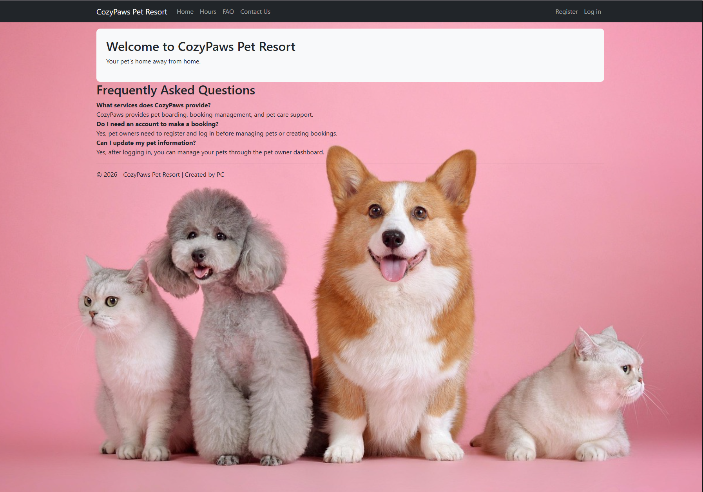

# CozyPaws Pet Boarding Management System

A web-based ASP.NET MVC application for managing pet boarding services.  
This system allows pet owners to manage pets and bookings, while employees and administrators manage operations through separate dashboards.

---

## Features

### Pet Owner
- Register and log in
- Manage pet profiles
- Add emergency contacts
- Add feeding plans
- Add pet medications
- Create boarding bookings
- Request booking cancellation
- View booking status updates

### Employee
- View all bookings
- Update booking status
- Handle cancellation requests
- View customer contact messages

### Admin
- Manage employee accounts
- Create employee accounts
- Edit employee information
- Delete employees
- View employee list dashboard

---

## Technologies Used

- ASP.NET MVC 5
- C#
- Entity Framework
- SQL Server
- ASP.NET Identity
- Bootstrap
- Razor Views

---

## Project Structure

```txt
Controllers/
Models/
Views/
Images/
Content/
Migrations/
```

---

## Roles

| Role | Description |
|------|-------------|
| Admin | Manages employees |
| Employee | Manages bookings and customer requests |
| PetOwner | Manages pets and bookings |

---

## How to Run

1. Clone the repository

```bash
git clone https://github.com/cpysleeper/Petboarding.git
```

2. Open solution in Visual Studio

3. Restore NuGet packages

4. Update database

```powershell
Update-Database
```

5. Run the project

---

## Notes

- Email service is used for account verification and password reset.
- Background images are customized for different layouts.
- Role-based authentication and authorization are implemented.

---

## Email and Admin Account Setup

### No-Reply Email Configuration

The system uses a dedicated Gmail account for sending:
- Email verification links
- Password reset emails
- System notifications

Update the following values inside `Web.config`:

```xml
<add key="emailSMTPURL" value="smtp.gmail.com" />
<add key="PortNumber" value="587" />
<add key="emailSMTPPasswordHash" value="YOUR_GMAIL_APP_PASSWORD" />
<add key="emailSMTPUserNameHash" value="YOUR_EMAIL@gmail.com" />
<add key="emailFromAddress" value="YOUR_EMAIL@gmail.com" />
<add key="emailFromName" value="CozyPaws" />
<add key="emailAppName" value="PetBoardingApp" />
```

### Gmail App Password Setup

1. Enable 2-Step Verification on your Google account
2. Go to:
   https://myaccount.google.com/apppasswords
3. Generate a new App Password
4. Copy the generated password
5. Replace:

```xml
YOUR_GMAIL_APP_PASSWORD
```

with the generated password

---

## Admin Account Setup

The application uses a predefined admin account.

Update the following values inside `Web.config`:

```xml
<add key="AdminUserEmail" value="admin@gmail.com" />
<add key="AdminUserPassword" value="YOUR_ADMIN_PASSWORD" />
```

The admin account is automatically created when the application starts if it does not already exist.

### Admin Permissions

The admin account can:
- Create employee accounts
- Edit employee information
- Delete employees
- Access the admin dashboard

---

## Important Security Note

Do NOT upload real passwords or app passwords to GitHub.

Before pushing the project:

- Replace real passwords with placeholders
- Or use environment variables / user secrets for production

# Screenshots

## Home Page



## Author

cpysleeper

